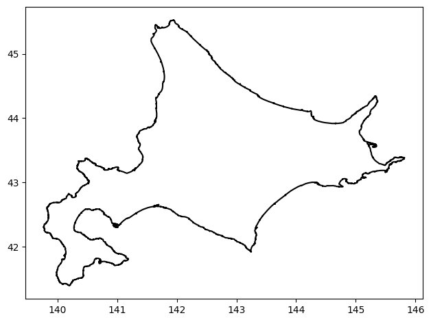
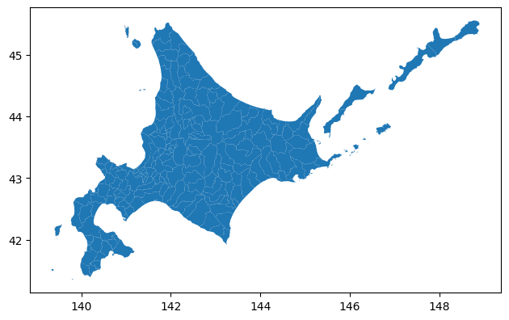

# process_GML_by_geopandas

- GMLのshpファイルをダウンロードして処理します
- output_figs に各都道府県のshpファイルの可視化と，最大のポリゴンの外線(exterior)のプロット図を生成します
- 最大のポリゴンをdillファイルに保存します

# Example (北海道)

- shpの可視化

- 面積が最大のポリゴンの外線の可視化

